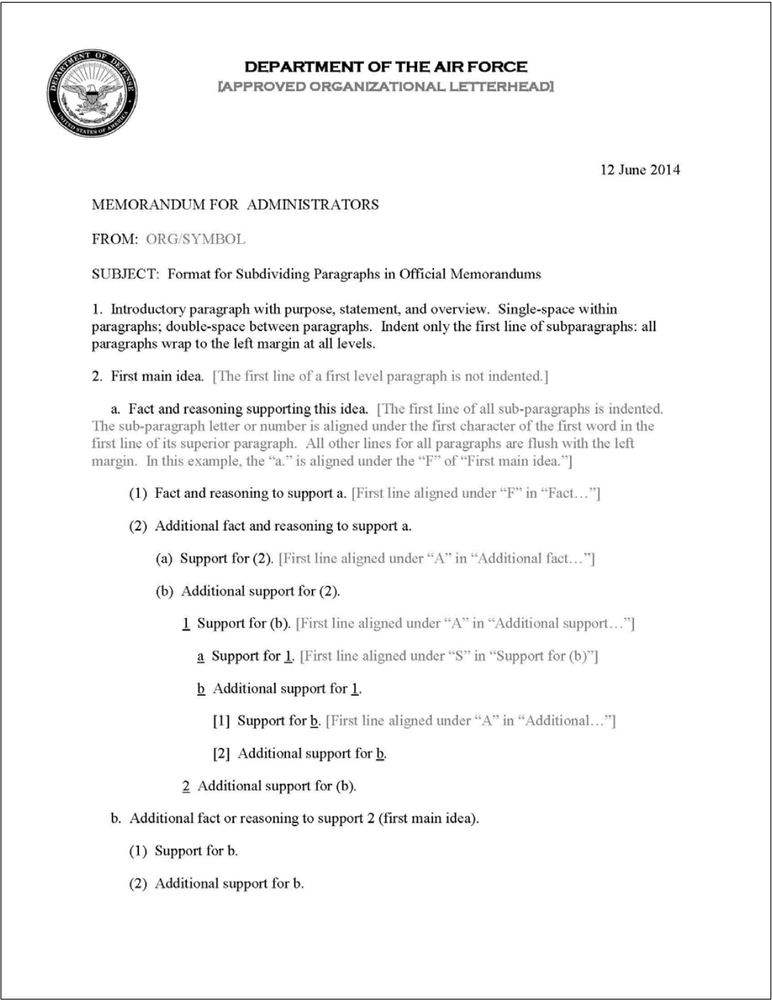

# Paragraph Numbering Refactor

## Problem

Current implementation uses hacky spacing calculations and recursive logic to achieve hierarchical paragraph numbering:

**Current approach (lib.typ:234-326, utils.typ:368-490):**
- Intercepts `enum.item` and `list.item` to track nesting level via state
- Uses `SET_LEVEL()` state updates to communicate level to paragraph renderer
- Recursively calculates indentation by measuring parent numbers (utils.typ:429-443)
- Manually manages spacing with `h(.25em)` workarounds (utils.typ:486-487)
- Renders content twice to count paragraphs (lib.typ:289-297, 320-323)
- Uses separate counters per level (`par-counter-0`, `par-counter-1`, etc.)

**Issues:**
- **Fragile spacing**: Recursive `calculate-paragraph-indent()` measures parent numbers and adds manual spacing buffers
- **Complex state management**: Multiple interacting states (`PAR_LEVEL_STATE`, `enum-level`, `par-counter`, `total-par-counter`)
- **Hacky workarounds**: Comment admits "Potential bug with spacing; use h(.25em) as an extra spacer" (utils.typ:486). A bug also occurs when a nested paragraph is used before the parent level is initialized.

## Goal

Refactor to use Typst's native numbering system for cleaner, more robust paragraph numbering.

## Desired State

See [Paragraph Numbering System](../designs/paragraph-numbering.md) design for full vision and architecture.

## Implementation Steps

### Phase 1: Research and Prototype

**Investigate Typst Native Capabilities:**
- Research Typst's `numbering()` function and pattern syntax
- Explore built-in counter system and automatic reset behavior
- Understand context queries for detecting nesting level within enum/list items
- Document findings in prose/research/ or as inline comments

**Create Experimental Implementation:**
- Build prototype numbering function using native Typst patterns
- Test indentation calculation without recursion (direct measurement approach)
- Validate level detection via show rule context rather than manual state
- Compare output against pdfs/usaf-template-gold.pdf for visual parity

### Phase 2: Refactor Paragraph Numbering Utilities

**Simplify Number Generation (utils.typ:371-418):**
- Replace `get-paragraph-numbering-format()` with direct pattern lookup
- Simplify `generate-paragraph-number()` to use Typst native counter display
- Eliminate custom counter value passing where Typst handles it natively

**Replace Indentation Calculation (utils.typ:420-443):**
- Remove recursive `calculate-paragraph-indent()` function
- Implement direct ancestor width measurement approach from design
- Eliminate spacing buffer workarounds (`h(.25em)` on utils.typ:487)

**Simplify State Management (utils.typ:445-461):**
- Evaluate if `PAR_LEVEL_STATE` can be replaced with context queries
- Remove or simplify `SET_LEVEL()` if nesting can be detected from show rule context
- Consolidate per-level counters if Typst handles resets automatically

**Refactor Paragraph Rendering (utils.typ:463-490):**
- Simplify `memo-par()` to use new indentation calculation
- Remove spacing workarounds and manual buffer adjustments
- Ensure hanging indent aligns with AFH 33-337 requirements

### Phase 3: Update Paragraph Body Renderer

**Refactor render-paragraph-body (primitives.typ:215-292):**
- Eliminate double-pass counting approach (lines 219-267)
- Remove `total-par-counter` mechanism if single-pass is viable
- Simplify enum.item and list.item show rules for cleaner level tracking
- Reduce state mutation and coordinate native counter increments
- Maintain orphan/widow prevention logic (lines 280-283)

**Verify Single-Paragraph Detection:**
- Ensure single-paragraph memos remain unnumbered per AFH 33-337
- Test multi-paragraph detection without double-pass counting

### Phase 4: Integration and Testing

**Validate Against Reference PDFs:**
- Compare output with pdfs/usaf-template-gold.pdf
- Verify spacing matches AFH 33-337 requirements
- Check indentation alignment at all nesting levels
- Confirm numbering patterns are identical

**Test Edge Cases:**
- Deeply nested paragraphs (4+ levels)
- Paragraphs split across pages
- Mixed enum and list nesting
- Single vs multi-paragraph memos
- Nested paragraphs before parent is initialized (current bug)

**Integration with Composable Architecture:**
- Ensure mainmatter show rule works correctly in chain
- Verify metadata inheritance from frontmatter (if needed)
- Confirm backmatter integration is unaffected
- See [Composable Show Rules Architecture](../designs/composable-show-rules.md)

### Phase 5: Cleanup and Documentation

**Remove Obsolete Code:**
- Delete unused recursive calculation functions
- Remove manual spacing workarounds and their comments
- Clean up deprecated state management code
- Eliminate per-level counter declarations if consolidated

**Update Internal Documentation:**
- Revise function docstrings to reflect new implementation
- Remove outdated comments about "potential bugs" and workarounds
- Document any remaining limitations or known edge cases
- Add references to design document in key functions

## Requirements
- Number unmarked top-level paragraphs by default
- Process bullet and numbered lists for paragraph nesting
- Maintain visual parity with current output (compare with `pdfs/`)
- Work within [Composable Show Rules Architecture](../designs/composable-show-rules.md)
- Comply with AFH 33-337 paragraph standards

### AFH 33-337

Must comply with AFH 33-337 official memorandum standards:

**Spacing (AFH 33-337):**
- Single-space text within paragraphs
- Double-space between paragraphs/subparagraphs (one blank line)
- May double-space text of one-paragraph memo less than 8 lines

**Numbering (AFH 33-337):**
- Number and letter each paragraph and subparagraph
- Single paragraph is NOT numbered
- Numbering patterns:
  - Level 0: `1.`, `2.`, `3.`
  - Level 1: `a.`, `b.`, `c.`
  - Level 2: `(1)`, `(2)`, `(3)`
  - Level 3: `(a)`, `(b)`, `(c)`
  - Level 4+: underlined format

**Indentation (AFH 33-337):**
- First paragraph: never indented, numbered and flush left
- Sub-paragraph first line: indent to align number/letter with first **character** of parent paragraph text (not parent number)
- Subsequent lines: all second and subsequent lines flush with left margin (no indent)

